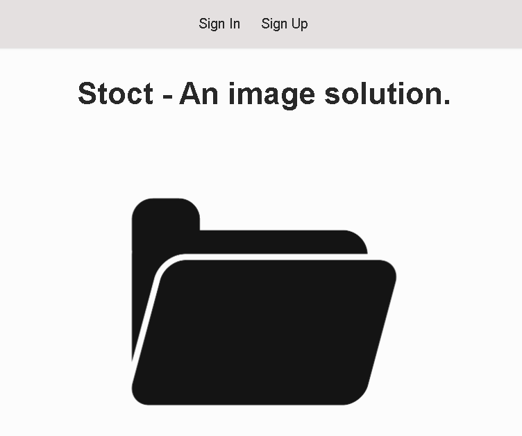

# STOCT

## Project Description 

My app is a cloud based personal image hosting tool.
The goal of my app is to allow users to create private repositories of images, allowing for storage and organization of personal photos, professional images, art, and memes.

## Wire Frame

**Home/Login Page**

## Technology used

**Javascript**

**Html**

**CSS**

**Node**

**Node Modules (See package.json)**

**MongoDB**

## Stretch Goals
I want to be able upload video files.

I want to be able upload gifs.

I want to be able to add new categories.
